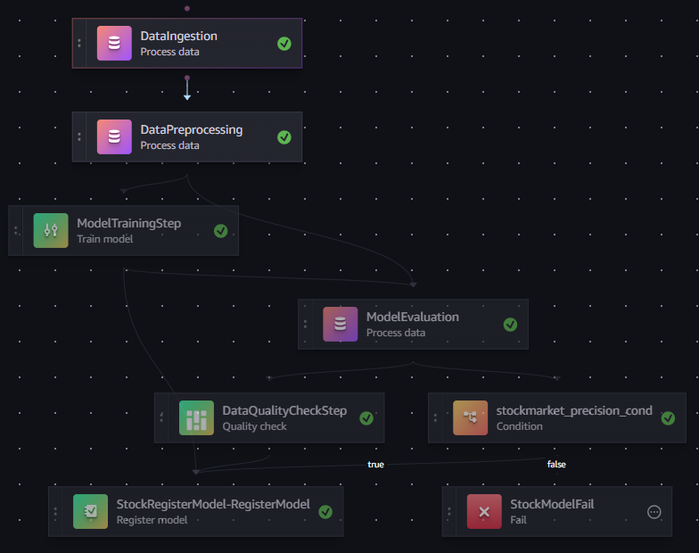
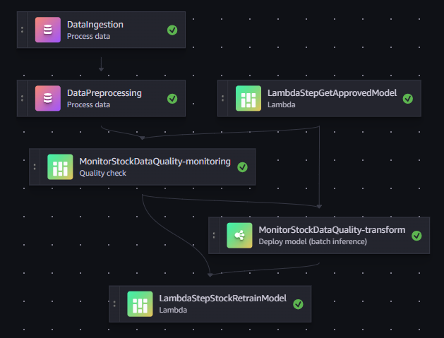

<!-- # Automated-Stock-Market-Prediction-System

This project demonstrates how to build an automated stock market (SP 500) prediction system using AWS SageMaker. The components of this system are:

1. [**SageMaker Training Pipeline**](sagemaker_training_pipeline.ipynb)
2. [**SageMaker Inference Pipeline**](sagemaker_inference_pipeline.ipynb)

## SageMaker Training Pipeline

This pipeline, as shown in the above diagram, is used to build and deploy the machine learning model. The training pipeline consists of the following steps:

- **Data Ingestion**: Fetches the stock market data (SP 500) from Yahoo Finance API and stores it in an S3 bucket for future reference.
- **Data Processing**: Retrieves the ingested data from the data ingestion phase and processes it into features ready for machine learning training.
- **Model Training**: Retrieves the features from the data processing stage, trains a machine learning model using the XGBoost algorithm to predict whether sp500 close price will increase(1) or decrease(0) the next day, and stores the artifacts in an S3 bucket.
- **Model Evaluation**: Evaluates the trained model using the precision_score metric.
- **Model Registry**: Registers the model to the SageMaker model registry when the precision_score is above 0.5.
- **Model Deployment**: Uses LambdaStep to deploy the registered model to a SageMaker real-time endpoint.

## SageMaker Inference Pipeline

This pipeline is used for making predictions. The inference pipeline consists of the following steps:
- **Data Ingestion**: Similar to the data ingestion in the training pipeline, it fetches inference data from the Yahoo Finance API.
- **Data Preprocessing**: It retrieves the inference data from the ingestion step, processes it, and stores it in an S3 bucket.
- **Model Inference**: This step uses a Lambda function to retrieve the processed inference data from the S3 bucket, pass it through the deployed model endpoint, and store the predicted data in DynamoDB.

## SageMaker Model Monitoring

The model monitoring includes:
- **Data Capture**: Enables data capture for the endpoint to monitor input and output data.
- **Baseline Data and Constraints**: Sets up baseline data and constraints for monitoring.
- **Monitoring Schedule**: Creats a monitoring schedule to regularly check for data drift and model quality.
- **CloudWatch Alarms**: Sets up CloudWatch alarms to notify when data drift or model quality issues are detected.

## Pipeline Scheduling

- **Training Pipeline Schedule**: It schedules the training pipeline using eventbridge. The scheduled pipeline run once every week.
- **Inference Pipeline Schedule**: It schedules inference pipeline using eventbridge. The pipeline runs every weekday (Mon - Fri) and predicts whether the SP500 will increase or decrease the next day.

## Images
### Training Pipeline DAG

### Inference Pipeline DAG

## Conclusion

This project provides a comprehensive solution for automated stock market prediction using AWS SageMaker. It includes training, inference, and monitoring pipelines to ensure the model remains accurate and reliable over time. -->

# Automated Stock Market Prediction System

The **Automated Stock Market Prediction System** is designed to predict whether the S&P 500 index will rise or fall the next day. It leverages AWS SageMaker Pipelines for:

- Training a machine learning model.
- Making predictions using batch transform.
- Monitoring the model for data drift and quality issues.

---

## 🧱 Architecture

The system is composed of two main components:

1. [**SageMaker Training Pipeline**](sagemaker_training_pipeline.py)
2. [**SageMaker Inference Pipeline**](sagemaker_inference_pipeline.py)

## 🛠️ SageMaker Training Pipeline

This pipeline builds and registers a machine learning model. It includes:

- **Data Ingestion**: Fetches historical S&P 500 data.  
  *Example dataset*: [training data](/sample_dataset/input_data.csv)

- **Data Preprocessing**: Cleans and transforms the data.  
  *Sample features generated*: [feature data](/sample_dataset/feature_data.csv)

- **Model Training**: Trains the model on the preprocessed dataset.

- **Model Evaluation**: Validates model performance metrics.

- **Data Capture**: Captures baseline statistics of the training dataset for monitoring purposes.

- **Model Registration**: Registers models that meet performance thresholds for deployment.

**Training Pipeline DAG**:  
 <!-- Replace with the actual image path -->

---

## 🔍 SageMaker Inference Pipeline

This pipeline makes predictions and monitors incoming data. It includes:

- **Data Input**: Receives new stock market data.

- **Data Preprocessing**: Aligns data format with the training schema.

- **Monitoring**: Detects any data drift or schema violations.

- **Batch Transform**: Uses the currently registered model to make predictions.

- **Retraining Trigger**: If data violations are detected, the training pipeline is automatically triggered for model retraining.

**Inference Pipeline DAG**:  
 <!-- Replace with the actual image path -->

---

## ⏰ Pipeline Triggering

 The  training and inference pipeline is triggered using **AWS EventBridge**. 

- **Training Pipeline**: Runs once a week to retrain the model with the latest data.
- **Inference Pipeline**: Runs every weekday (Monday–Friday) to predict the next day's S&P 500 movement.

---

## 📁 Repository Structure

- [docker/](/docker)                   # Dockerfiles and containerization scripts
- [images/](/images)                   # Pipeline DAGs and visual assets
- [inference_scripts/](/inference_scripts)    # Scripts for the inference process
- [inference_scripts_test/](/inference_scripts_test)   # Test scripts for inference pipeline
- [training_scripts/](/training_scripts)          # Scripts for model training
- [training_scripts_test/](/training_scripts_test)     # Test scripts for training pipeline
- [sagemaker_inference_pipeline.py](/sagemaker_inference_pipeline.py)    # Defines inference pipeline
- [sagemaker_training_pipeline.py](/sagemaker_training_pipeline.py)      # Defines training pipeline
- [requirements.txt](/requirements.txt)           # Project dependencies

---

## 🧾 Prerequisites
To use this project, you’ll need:

- An AWS account with the necessary permissions for the required AWS services (see 'Technology Used').

- Python 3.6 or higher

- Required Python libraries installed (see requirements.txt).

- AWS CLI configured with proper credentials

---

## 🧰 Technologies Used
This project leverages the following AWS services:

- Amazon SageMaker

- Amazon S3

- AWS Lambda

- Amazon EventBridge

- Amazon CloudWatch

- ECR